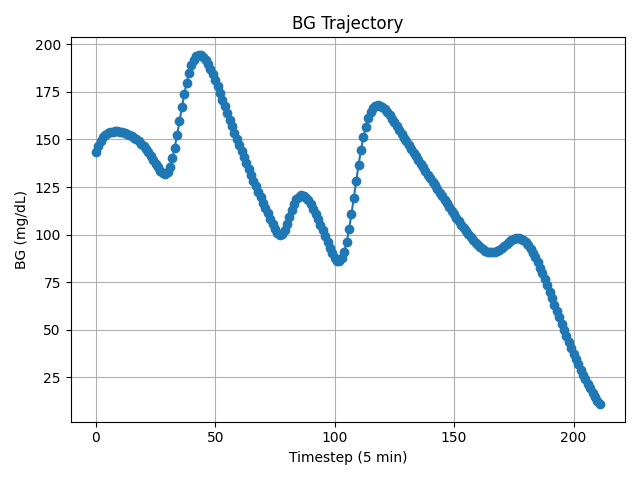

# Blood Glucose Prediction & Control in Type 1 Diabetes

An end-to-end pipeline for predicting future blood glucose (BG) levels with LightGBM and controlling BG via reinforcement learning (SAC & PPO) using the Sim-glucose OpenAI Gym environment.

---

## 🧠 Model Overview

### LightGBM Regressor

*Fig1. LightGBM model architecture*

* Learns to predict future BG using tabular features from the last hour of CGM, insulin, meals, and wearable sensor data (heart rate, steps, calories).
* **Algorithm**: Gradient boosting with decision trees (`LGBMRegressor`).
* **Objective**: Minimize RMSE on held-out time-series folds (expanding-window CV).


*Fig2. LightGBM model inference BG+1:00*

* **Inference loop**: At each timestep, the RL agent queries the predictor to estimate BG\_{t+1} given current state.

### SAC & PPO Agent


*Fig3. SAC & PPO RL model architecture*

#### SAC Baseline Agent

* Off-policy actor-critic algorithm that maximizes expected reward minus an entropy regularization term.
* **Reward**: Risk-delta (difference in LBGI/HBGI indices) with heavy penalties for hypo (<70 mg/dL) and hyper (>180 mg/dL) events.
* **Filter**: Rule-based safety filter blocks excessive insulin when BG drops below threshold.

#### PPO + LightGBM Agent

* On-policy proximal policy optimization wrapped around a Beta action distribution for continuous insulin dosing.
* **Integrated Predictor**: LightGBM BG forecast feeds into the PPO reward and decision logic.
* **Reward**: Custom continuous function penalizing deviations from target 125 mg/dL, scaled at ±σ and multiplied beyond ±2σ.
* **Policy**: MLP policy outputs insulin dose in \[0,1] normalized units.

---

## 🔗 References

* Kaggle BRIST1D 1st Solution: [https://www.kaggle.com/competitions/brist1d/discussion/555236](https://www.kaggle.com/competitions/brist1d/discussion/555236)
* BRIST1D 1st Solution Repo: [https://github.com/scuya2050/brist1d\_blood\_glucose\_prediction\_competition](https://github.com/scuya2050/brist1d_blood_glucose_prediction_competition)
* Sim-glucose Gym Env: [https://github.com/jxx123/simglucose](https://github.com/jxx123/simglucose)
* PPO controller, “A safe-enhanced fully closed-loop artificial pancreas controller based on deep reinforcement learning”, 2025:
  [https://journals.plos.org/plosone/article?id=10.1371/journal.pone.0317662](https://journals.plos.org/plosone/article?id=10.1371/journal.pone.0317662)

---

## 📂 Repository Structure

```
.
├── prepare_data.py                    # Kaggle dataset preprocessing script
├── train.py                           # LightGBM training script
├── lgbm_model.pkl                     # trained LightGBM model
├── baseline.ipynb                     # SAC & PPO baseline agent notebook
├── simglucose_ppo_lgbm.py             # PPO + LightGBM training & evaluation script
├── ppo_simglucose_hist_tree_adol2.zip # PPO Model
├── Result/                            # archive results
├── doc/                               # midterm, final PPT
└── requirements.txt                   # Python dependencies
```

---

## ⚙️ Environment Setup

1. Clone this repository and enter its root directory.

2. Install dependencies:

   ```
   pip install -r requirements.txt
   ```

3. Make sure you have the following files in place:

   * `prepare_data.py`, `train.py`
   * `simglucose_ppo_lgbm.py`, `baseline.ipynb`
   * `lgbm_model.pkl` (trained LightGBM regressor)
   * `ppo_simglucose_hist_tree_adol2.zip` (trained PPO agent)

4. Python 3.12+ is required.

---

## 🗄️ Data Preparation & LightGBM Model

### 0. Download Kaggle Dataset
* Download 'BrisT1D Blood Glucose Prediction Competition' dataset.
  * https://www.kaggle.com/competitions/brist1d/data

* Place them at ./data/raw.

### 1. Preprocess Kaggle BRIST1D Dataset

```
python prepare_data.py
```

* **Data sources**

  * CGM readings (5-minute intervals)
  * Self-reported carbs & activity
  * Insulin pump doses
  * Wearable sensor data (heart rate, steps, calories)

* **Preprocessing steps**

  * Sliding window expansion (12 lags × 5 min = 1 h history)
  * Time-of-day trigonometric encoding (sin/cos)
  * Forward/backward interpolation for missing CGM, insulin, HR, calories
  * Zero-fill carbs & activity flags

### 2. Train & Serialize LightGBM Regressor

```
python train.py
```

* **Model**: `LGBMRegressor`
* **Features**:

  * BG, insulin, carbs, HR, steps, calories at t−{0…60 min}
  * Patient statistics (mean, std, skewness, kurtosis)
* **Validation**: TabularExpandingWindowCV (time-aware CV)
* **Metric**: RMSE

### 3. Optional: Place the resulting model file
* Already included in the project.
```
cp ./model/lgbm_gap_1_prior_12_addition_0_model_standard.pkl ./lgbm_model.pkl
```

---

## 🤖 Reinforcement Learning Control

### 3. Train RL Agent

* **Agents**:

  1. **SAC** (baseline, in `baseline.ipynb`)

     * Risk-delta reward
     * Rule-based action filter

  2. **PPO + LightGBM** (in `simglucose_ppo_lgbm.py`)

     * LightGBM predictor in the loop
     * Custom continuous reward (penalize hypo/hyper)

```
python simglucose_ppo_lgbm.py train
```

*Baseline SAC agent training and analysis available in `baseline.ipynb`.*

#### 3.1. Check TensorBoard

```
tensorboard --logdir ./logs
```

* Browse at [http://localhost:6006/#timeseries](http://localhost:6006/#timeseries)

### 4. Evaluate & Visualize

```
python simglucose_ppo_lgbm.py eval --episodes 20 
```

#### 4.1 Key Metrics (20 episodes)

| Method                      | TIR (%) | LBGI (mean) | HBGI (mean) |
| --------------------------- | ------: | ----------: | ----------: |
| **SAC (baseline)**          |   23.30 |        0.00 |       33.12 |
| **SAC + Filter**            |   61.09 |       52.39 |        1.94 |
| **PPO**                     |   22.72 |        0.00 |       33.39 |
| **PPO + LightGBM**          |   60.76 |       41.45 |        2.73 |
| **PPO + LightGBM + Reward** |   67.93 |       28.39 |        4.61 |

#### 4.2 BG & Insulin Trajectories

- Since simulator has randomness, the figure will be changed for each simulation.



*Fig 4. Future BG vs. time under PPO + LGBM + custom reward*


*Fig 5. Administered insulin over time*

---

## 🚀 Future Work

* Apply **Transformer-based predictor**: pre-trained on simulator data
* Apply **Advanced PPO controller**: leveraging Beta policy & advanced stabilization tricks

---